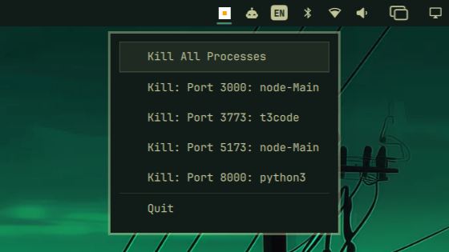
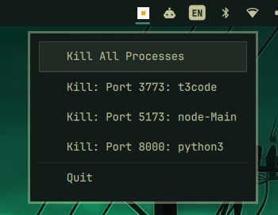
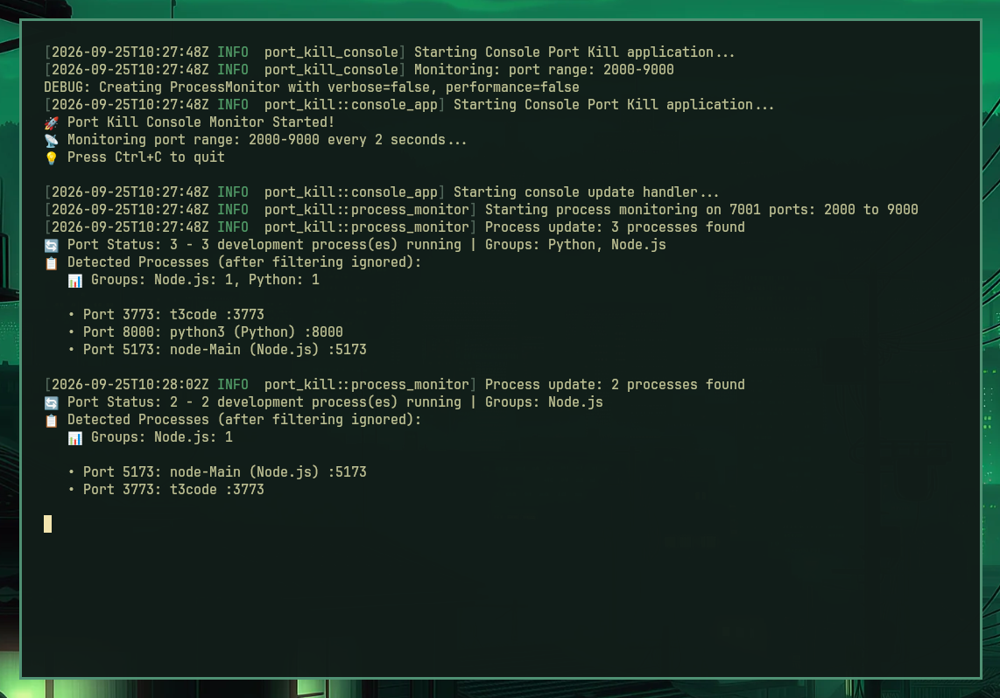

# Port Kill for Omarchy

View and stop development processes from the Omarchy bar with
[Port Kill](https://portkill.com/) ([GitHub](https://github.com/treadiehq/port-kill)).



This is an independent integration. Port Kill scans for processes and stops
them; the plugin adds a bar icon and menu while its monitor is running.

## Requirements

- [Omarchy Quattro](https://omarchy.org/).
- Port Kill, installed with its official installer:

  ```bash
  curl -fsSL https://portkill.com/install | bash
  ```

- `lsof`, which Port Kill uses to find listening processes. Install it separately:

  ```bash
  sudo pacman -S lsof
  ```

## Install

```bash
omarchy plugin add https://github.com/jesusarchive/omarchy-port-kill.git --enable
```

Add Port Kill to the app launcher with immediate bar updates on startup and exit:

```bash
omarchy tui install "Port Kill" "bash $HOME/.config/omarchy/plugins/jesusarchive.port-kill/portkill.sh launch" float \
  https://raw.githubusercontent.com/treadiehq/port-kill/main/assets/port-kill.png
```

Or launch `port-kill-console` directly. The bar detects it on its next refresh:

```bash
omarchy tui install "Port Kill" port-kill-console float \
  https://raw.githubusercontent.com/treadiehq/port-kill/main/assets/port-kill.png
```

Either command replaces an existing Port Kill launcher entry.

## Use

Select Port Kill in the app launcher or run `port-kill-console` in a terminal.
Click the bar icon to open the menu.



- **Kill All Processes** stops processes on ports 2000 through 9000.
- **Kill: Port N: process** stops processes listening on that port.
- **Quit** stops your Port Kill monitors and hides the bar icon. Development
  processes keep running.

Stopping a port also closes any other ports owned by those processes. Kill
actions run immediately, without confirmation.

The icon's center is green when no processes are found, orange for 1 to 9,
and red for 10 or more. Grey means a dependency is missing or a command failed;
hover over the icon to read the error.

The terminal logs process changes, including those made from the menu.
Press Ctrl+C in the terminal to stop the monitor.



## Keyboard controls

| Key | Action |
| --- | --- |
| Up / Down or `k` / `j` | Move through the menu |
| Enter / Space | Activate the selected item |
| `x` | Stop the selected port; does nothing on Kill All or Quit |
| `a` | Stop processes on ports 2000 through 9000 |
| `r` | Refresh the list |
| Tab / Shift+Tab | Switch to the next / previous bar panel |
| Escape | Close the menu |

To toggle the menu from a terminal or a custom shortcut:

```bash
omarchy-shell jesusarchive.port-kill toggle
```

## Settings

Change settings in the bar editor or from a terminal:

| Setting | Key | Default | Description |
| --- | --- | --- | --- |
| Refresh interval | `refreshIntervalSec` | `2` seconds | How often the bar checks for the monitor and refreshes its process list. Accepts 1 to 300 seconds. |

```bash
omarchy bar set jesusarchive.port-kill refreshIntervalSec 2 --json
```

This changes the bar's refresh interval, not Port Kill's terminal monitor.

## Update

```bash
omarchy plugin update jesusarchive.port-kill
```

## Remove

```bash
omarchy plugin remove jesusarchive.port-kill
```

Port Kill and its launcher entry remain installed. The launcher uses the
plugin's script, so remove the entry too or recreate it with `port-kill-console`
as its command. To remove both the launcher and Port Kill:

```bash
omarchy tui remove "Port Kill"
rm ~/.local/bin/port-kill ~/.local/bin/port-kill-console
```

## Development

Run from the repository root with Node.js installed:

```bash
node --test tests/*.test.js
omarchy plugin validate .
```

Tests use fake binaries and isolated monitor discovery. With Port Kill and
`lsof` installed, also run the integration test:

```bash
PORT_KILL_INTEGRATION=1 node --test tests/*.test.js
```

It starts its own monitor and listener on an available port between 8900 and
8999, verifies discovery, and stops that listener.

## License

[MIT](LICENSE). Port Kill is a separate project by Treadie under the
FSL-1.1-MIT license.
