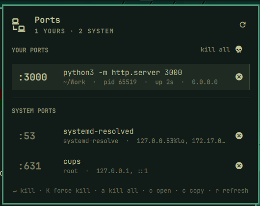

# Port Killer for Omarchy

A bar widget for the [Omarchy](https://omarchy.org) shell that shows what's
listening on which port, and lets you kill it without leaving the desktop.
It's for the dev server that didn't shut down properly and is still holding
`:3000`.



- The bar icon shows how many of **your** processes hold a listening port.
- For each port, the panel shows the command, the **project directory** it
  was started from, the pid, uptime, and bind addresses.
- **Kill** sends SIGTERM and escalates to SIGKILL if the process hasn't exited
  after 3 s. **Force kill** sends SIGKILL right away. **Kill all** clears every port
  you own.
- **System ports** (owned by root or service users) are labelled with their
  systemd unit. Killing one asks for your password through Omarchy's polkit
  dialog.
- You can filter which ports are shown and hide processes by name.
  Everything is keyboard-driven like the built-in Omarchy panels.

Inspired by [treadiehq/port-kill](https://github.com/treadiehq/port-kill).

## Install

```bash
omarchy plugin add https://github.com/jesusarchive/omarchy-port-killer.git --enable
```

The widget lands in the right section of the bar. Move it with
`omarchy bar move jesusarchive.port-killer --section <left|center|right>`.

Manual install: copy this folder to
`~/.config/omarchy/plugins/jesusarchive.port-killer/`, then run
`omarchy plugin enable jesusarchive.port-killer`.

Requirements: `ss` (iproute2), `pkexec` (polkit), and `wl-copy` for copying
URLs. All three ship with Omarchy.

## Use

| Where | Action |
|---|---|
| Bar: left click | open the panel |
| Bar: right click | refresh |
| Bar: middle click | kill all your ports (asks first) |
| Row: click | open `http://localhost:<port>` |
| Row: middle click | copy the URL |
| Row: kill button | kill the process (asks first) |

Keys while the panel is open:

| Key | Action |
|---|---|
| `j` / `k` / arrows | move |
| `Enter` / `x` | kill the selected process |
| `K` | force kill it with SIGKILL |
| `a` / `A` | kill / force kill all your ports |
| `o` | open in the browser |
| `c` | copy the URL |
| `r` | refresh |
| `Tab` | next bar panel |
| `Esc` | close |

In the confirmation dialog, `y` / `n`, `Enter`, `Esc` and the arrow keys work.

### Scripting

The widget registers an IPC target:

```bash
omarchy-shell jesusarchive.port-killer toggle
omarchy-shell jesusarchive.port-killer list        # JSON of the rows shown
omarchy-shell jesusarchive.port-killer kill 3000   # your own ports only, no dialog
```

To toggle it from a key, add a line like this to `~/.config/hypr/bindings.lua`:

```lua
o.bind("SUPER + ALT + P", "Ports", "omarchy-shell jesusarchive.port-killer toggle")
```

## Settings

Edit these inline on the widget's entry in `~/.config/omarchy/shell.json`,
or in Omarchy's settings panel:

| Key | Default | Meaning |
|---|---|---|
| `refreshIntervalSec` | `5` | How often to rescan (2–300 s) |
| `ports` | `""` | Only show these ports, e.g. `3000,5173,8000-8999`. Empty shows every port |
| `ignorePorts` | `""` | Ports or ranges to hide, e.g. `53,631` |
| `ignoreProcesses` | `""` | Process or unit names to hide, e.g. `cups,avahi-daemon` |
| `includeUdp` | `false` | Also list UDP sockets |
| `showSystemPorts` | `true` | Show ports owned by root or other users |
| `hideWhenEmpty` | `false` | Hide the bar icon when none of your processes hold a port |

## How it works

- `scan.sh` runs `ss -lnpe -tu` and reads `/proc/<pid>` for the command line
  and working directory. `ss` only attributes a socket to a process you're
  allowed to inspect, so a socket without a pid belongs to root or another
  user. Those rows are labelled with the systemd unit from the socket's cgroup.
- `kill.sh` looks up the pids again at kill time with `ss`, so a stale scan
  can't signal a reused pid. It then sends TERM, waits up to 3 s, and sends
  KILL. For system ports the same script runs under `pkexec`. PID 1 is never
  signalled: with socket activation, systemd holds the socket too.
- Killing a systemd service's process usually just makes systemd restart it.
  For services, `systemctl stop <unit>` is the right tool.

## Development

```bash
node --test tests/                        # parser tests
omarchy plugin validate .                 # manifest check
rsync -a --delete --exclude .git ./ ~/.config/omarchy/plugins/jesusarchive.port-killer/
omarchy restart shell                     # QML changes need a restart to show up
```

Files: `manifest.json` (plugin metadata and settings schema), `Panel.qml`
(bar button and popup), `Service.qml` (polling and killing), `Model.js`
(pure parsing, tested with node), `scan.sh`, `kill.sh`.

## License

MIT
